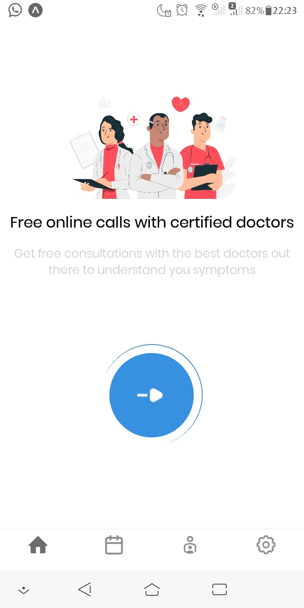
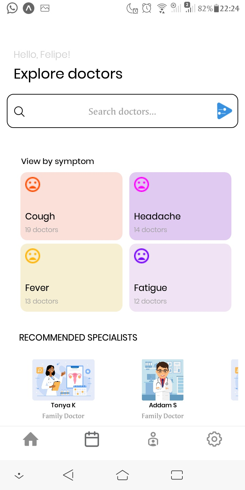
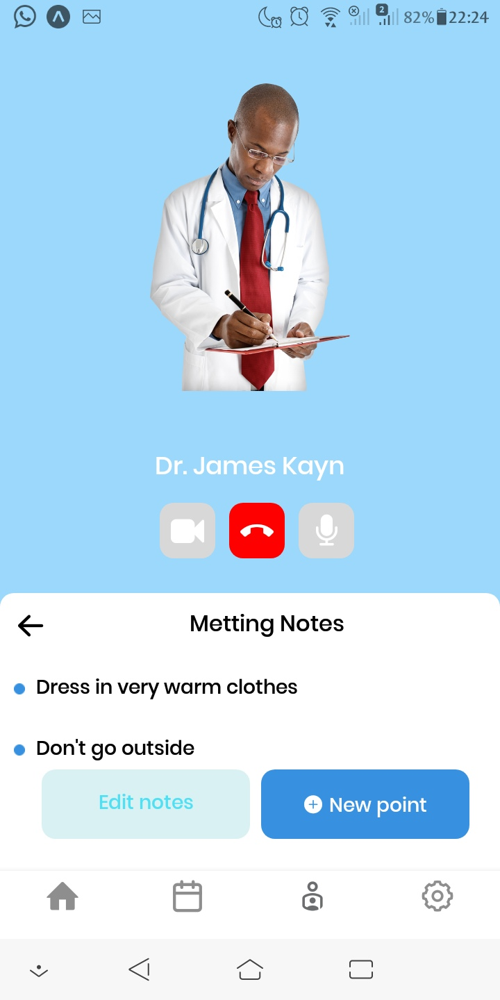

<h1 align='center'>React Ui Dribble 📲</h1>

Desenvolvendo o layout do aplicativo feito por um design e disponibilizado no site 'Dribble' ( foi necessário fazer algumas modificaçoes porque alguns ícones não estavam disponíveis)

  

Tela inicial do aplicativo. Aqui nós temos as informações sobre o aplicativo. 👌

  

Tela de busca de profissinais da saúde, verificação de sintomas e um scroll horizontal na parte inferior com algumas recomendações de doutores certificados.

Tela aonde o paciente pode ficar em ligação com o doutor para fazer sua consulta. Também é possível fazer algumas anotações e agendar outros assuntos sobre.

<h2 align="center">Layout do aplicativo concluído 🚧</h2>

<h2 align="center"> Tecnologias ⚙️ </h2>

 ✏️ React Native

 ✏️ React Navigation

<h3 align="center">Desenvolvido por Felipe Costa 🥇</h3>